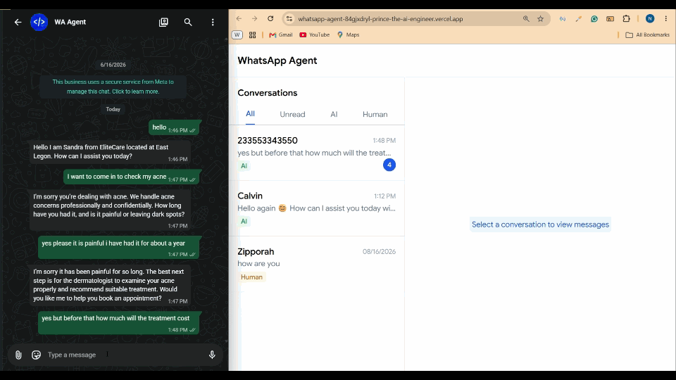
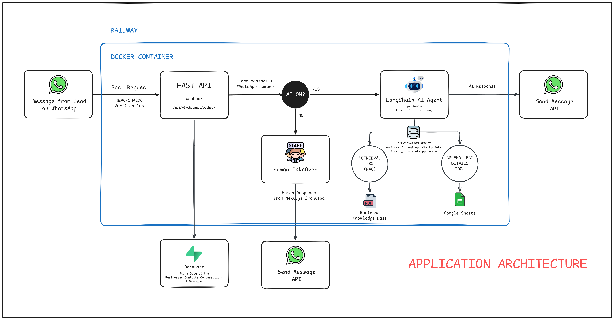
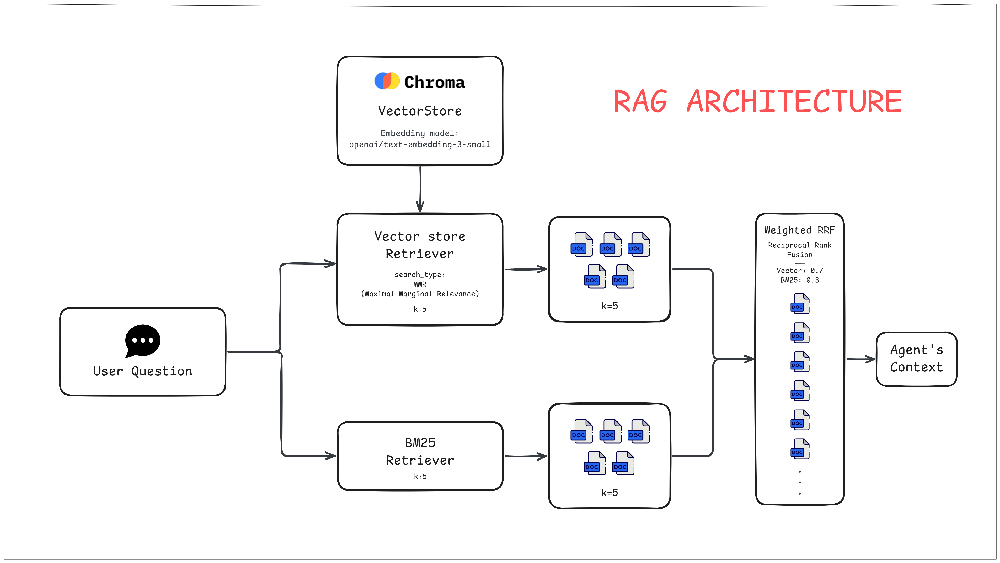

# WhatsApp AI Agent

> An AI-powered WhatsApp agent that captures and qualifies leads and answers business-related questions.

## Demo



An end-to-end demonstration of the agent answering a business
question, capturing lead information, and qualifying the lead.

## Features

### Customer-facing

- **WhatsApp AI assistant** — Answers business-related questions and engages customers through natural conversation.

- **Knowledge-based question answering** — Uses retrieval-augmented generation (RAG) to provide answers grounded in the business knowledge base.

- **Lead capture and qualification** — Collects relevant lead information and qualifies prospective customers through conversation.

- **Appointment booking** — Guides customers through the booking workflow and collects the information required to schedule an appointment.

- **Lead management with Google Sheets** — Uses a Google Sheets integration as an agent tool to record and manage captured lead information.

- **Multi-turn conversations** — Handles workflows that require multiple messages and follow-up questions, including lead qualification and appointment booking.

### Business controls

- **Human takeover** — Allows staff to disable AI responses and take over customer conversations when human assistance is needed.

### Engineering

- **Tool calling** — Gives the agent access to specialized tools for retrieving information and performing business actions.

- **LLM evaluation** — Uses single-turn and multi-turn evaluation datasets to measure agent correctness and behavioral alignment.

- **Automated regression gates** — Blocks pull requests when agent performance falls below defined evaluation thresholds.

- **PR evaluation reporting** — Automatically posts evaluation results to pull requests and updates the existing report when new evaluations run.

- **CI/CD pipeline** — Runs automated agent evaluations on pull requests, enforces regression gates before merging, and automatically deploys merged changes to production through Railway.

- **Production smoke testing** — Verifies that the deployed production API is healthy after changes reach `main`.

## Architecture

The system is built around a FastAPI backend that connects the WhatsApp messaging layer, AI agent, business data, and supporting services.



### Application Architecture

Incoming WhatsApp messages are received by the FastAPI webhook after WhatsApp webhook verification. The backend determines whether the AI agent is enabled for the business.

When the AI agent is enabled, the message is passed to a LangChain AI agent powered by an OpenRouter-hosted LLM. The agent can use specialized tools to retrieve information from the business knowledge base and append qualified lead details to Google Sheets.

The agent uses PostgreSQL-backed LangGraph checkpointing to maintain conversation state using the WhatsApp number as the conversation thread identifier.

When the AI agent is disabled, the conversation can be handled directly by staff through the Next.js frontend, providing a human takeover path without AI responses interfering with the conversation.

The FastAPI backend and AI agent are containerized with Docker and deployed to Railway. Supabase is used for application data including contacts, conversations, and messages.

### RAG Architecture

The agent uses a hybrid retrieval pipeline to ground responses in the business knowledge base.



User questions are passed to two complementary retrievers:

- **Vector retrieval** using Chroma with `text-embedding-3-small` and Maximal Marginal Relevance (MMR).
- **Lexical retrieval** using BM25.

Both retrievers return their top 5 results. The results are combined using weighted Reciprocal Rank Fusion (RRF), with a weight of `0.7` for vector retrieval and `0.3` for BM25. The resulting documents are provided to the agent as context for generating grounded responses.

This hybrid approach combines semantic similarity with keyword-based retrieval, allowing the system to handle both conceptually similar questions and queries containing specific business terminology.

## How It Works

1. **Customer sends a WhatsApp message**

   A lead sends a message to the business through WhatsApp. The WhatsApp webhook sends the incoming request to the FastAPI backend, where the request signature is verified using HMAC-SHA256.

2. **FastAPI processes the message**

   The webhook extracts the incoming message and WhatsApp number, then determines whether the AI agent is currently enabled for the business.

3. **Human takeover when AI is disabled**

   If the AI agent is turned off, the message is routed to the human-handling workflow. Staff can respond to the customer through the Next.js dashboard without AI-generated responses interfering with the conversation.

4. **AI agent processes the conversation**

   When the AI agent is enabled, the message is passed to the LangChain agent. The agent uses the conversation thread associated with the customer's WhatsApp number to maintain context across multiple messages.

5. **Agent retrieves business knowledge when needed**

   When a question requires information from the business knowledge base, the agent invokes the retrieval tool. The hybrid RAG pipeline combines semantic vector retrieval with BM25 lexical retrieval and uses weighted Reciprocal Rank Fusion to produce relevant context for the agent.

6. **Agent uses tools to perform business actions**

   When appropriate, the agent can invoke tools such as the lead-details tool to capture information collected during the conversation and append it to Google Sheets.

7. **Agent responds to the customer**

   The agent generates a response using the conversation context, retrieved business knowledge, and available tool results. The response is sent back to the customer through the WhatsApp Send Message API.

8. **Conversation and business data are persisted**

   Application data such as contacts, conversations, and messages are stored in the database, while LangGraph's PostgreSQL checkpointer maintains the agent's conversational state for subsequent turns.

## Tech Stack

### AI & Agent

- **Python** — Core application and agent implementation.
- **LangChain** — Agent orchestration and tool integration.
- **LangGraph** — Agent state management and PostgreSQL-backed conversation checkpointing.
- **OpenRouter** — LLM access.
- **LangSmith** — Agent tracing, observability, and evaluation.

### Retrieval & Knowledge

- **Chroma** — Vector store for semantic retrieval.
- **OpenAI `text-embedding-3-small`** — Document embeddings.
- **BM25** — Lexical keyword-based retrieval.
- **Ensemble Retrieval / Weighted RRF** — Combines semantic and lexical retrieval results.
- **RAG** — Grounds agent responses in the business knowledge base.

### Backend & Data

- **FastAPI** — REST API and WhatsApp webhook handling.
- **PostgreSQL / Supabase** — Application data and agent conversation checkpoints.
- **Google Sheets API** — Lead capture and storage through an agent tool.
- **Meta WhatsApp API** — Customer messaging and webhook integration.

### Frontend

- **Next.js** — Business dashboard and human-takeover interface.
- **React / TypeScript** — Frontend components and application logic.

### Infrastructure & DevOps

- **Docker** — Containerization.
- **Railway** — Production deployment.
- **GitHub Actions** — CI/CD, automated evaluations, regression gates, and production smoke tests.
- **uv** — Python dependency and environment management.

## Project Structure

```text
whatsapp-agent/
├── app/
│   ├── agent/              # LangChain AI agent and agent tools
│   ├── api/                # FastAPI application and API routes
│   ├── db/                 # Database client and persistence
│   ├── prompts/            # Agent system prompts
│   ├── rag/                # RAG ingestion, embeddings, retrieval and chunking
│   ├── schemas/             # API/data schemas
│   ├── services/            # Business logic and external service integrations
│   └── config.py            # Application configuration
│
├── data/                   # Knowledge base and local vector store
│   ├── chroma_db/
│   └── *.pdf
│
├── evals/                  # Agent evaluation and regression analysis
│   ├── run_eval.py
│   ├── run_multiturn_eval.py
│   ├── analyze_eval.py
│   └── analyze_multiturn_eval.py
│
├── frontend/               # Next.js business dashboard
│
├── tests/                  # Application tests
│
├── notebooks/              # Development and experimentation notebooks
│
├── docs/                   # Project documentation and architecture diagrams
│
├── .github/
│   └── workflows/          # CI/CD and automated evaluation workflows
│
├── Dockerfile              # Production container definition
├── pyproject.toml          # Python project configuration and dependencies
└── uv.lock                 # Locked Python dependencies

```

## Installation

### Prerequisites

Make sure you have the following installed:

- Python
- [uv](https://docs.astral.sh/uv/)
- Node.js and npm
- Git

### Clone the repository

```bash
git clone https://github.com/pnoboesam/whatsapp-agent.git
cd whatsapp-agent
```

### Backend setup

Install the Python dependencies with `uv`:

```bash
uv sync
```

Configure the required environment variables as described in the [Environment Variables](#environment-variables) section.

Start the FastAPI development server:

```bash
uv run uvicorn app.api.main:app --reload
```

The API will be available at:

```text
http://127.0.0.1:8000
```

Interactive API documentation is available at:

```text
http://127.0.0.1:8000/docs
```

### Frontend setup

In a separate terminal:

```bash
cd frontend
npm install
npm run dev
```

The Next.js dashboard will be available at:

```text
http://localhost:3000
```

### Docker

The backend can also be run as a Docker container using the included `Dockerfile`.

```bash
docker build -t whatsapp-agent .
docker run --env-file .env -p 8000:8000 whatsapp-agent
```

## Environment Variables

Create a `.env` file in the project root and add the required environment variables.

> **Important:** Never commit your `.env` file, API keys, access tokens, service-account credentials, or other secrets to the repository.

### LangSmith

Used for agent tracing, observability, and evaluation.

```env
LANGSMITH_TRACING=
LANGSMITH_ENDPOINT=
LANGSMITH_API_KEY=
LANGSMITH_PROJECT=
```

### LLM Provider

Used to access the language model through OpenRouter.

```env
OPENROUTER_API_KEY=
```

### Supabase

Used for application data and database-backed conversation state.

```env
SUPABASE_URL=
SUPABASE_SERVICE_ROLE_KEY=
DATABASE_URL=
```

### WhatsApp / Meta

Used for WhatsApp webhook verification, request signature verification, and sending messages.

```env
META_APP_SECRET=
WHATSAPP_PHONE_NUMBER_ID=
WHATSAPP_VERIFY_TOKEN=
WHATSAPP_ACCESS_TOKEN=
```

### Google Sheets

The agent uses a Google service account to authenticate with Google Sheets and append qualified lead information.

For local development, the application can authenticate using a service-account JSON file:

```text
secrets/google-service-account.json
```

For Docker and Railway deployments, the service-account credentials can instead be provided through the environment variable:

```env
GOOGLE_SERVICE_ACCOUNT_JSON=
```

The value should contain the complete Google service-account JSON credentials.

### Example `.env`

```env
LANGSMITH_TRACING=true
LANGSMITH_ENDPOINT=https://api.smith.langchain.com
LANGSMITH_API_KEY=your_langsmith_api_key
LANGSMITH_PROJECT=your_project_name

OPENROUTER_API_KEY=your_openrouter_api_key

SUPABASE_URL=your_supabase_url
SUPABASE_SERVICE_ROLE_KEY=your_supabase_service_role_key
DATABASE_URL=your_database_url

META_APP_SECRET=your_meta_app_secret
WHATSAPP_PHONE_NUMBER_ID=your_whatsapp_phone_number_id
WHATSAPP_VERIFY_TOKEN=your_whatsapp_verify_token
WHATSAPP_ACCESS_TOKEN=your_whatsapp_access_token

GOOGLE_SERVICE_ACCOUNT_JSON=your_google_service_account_json
```

All values shown above are placeholders and should be replaced with credentials from the corresponding services.

For local development, the Google service-account JSON can be stored at `secrets/google-service-account.json` instead of using `GOOGLE_SERVICE_ACCOUNT_JSON`

## API

The FastAPI backend exposes REST endpoints for WhatsApp messaging, chat interactions, contacts, conversations, and production health monitoring.

Interactive API documentation is available through Swagger UI at:

```text
http://127.0.0.1:8000/docs
```

### Health

| Method | Endpoint          | Description                           |
| ------ | ----------------- | ------------------------------------- |
| `GET`  | `/api/v1/health/` | Returns the health status of the API. |

### Chat

| Method | Endpoint        | Description                                               |
| ------ | --------------- | --------------------------------------------------------- |
| `POST` | `/api/v1/chat/` | Sends a message to the AI agent and returns its response. |

### WhatsApp

| Method | Endpoint                   | Description                          |
| ------ | -------------------------- | ------------------------------------ |
| `GET`  | `/api/v1/whatsapp/webhook` | Verifies the WhatsApp webhook.       |
| `POST` | `/api/v1/whatsapp/webhook` | Receives incoming WhatsApp messages. |

Incoming WhatsApp requests are verified using HMAC-SHA256 signature validation before being processed.

### Contacts

| Method | Endpoint                        | Description                |
| ------ | ------------------------------- | -------------------------- |
| `GET`  | `/api/v1/contacts/{contact_id}` | Retrieves a contact by ID. |

### Conversations

| Method | Endpoint                                           | Description                                     |
| ------ | -------------------------------------------------- | ----------------------------------------------- |
| `GET`  | `/api/v1/conversations`                            | Retrieves conversations.                        |
| `GET`  | `/api/v1/conversations/{conversation_id}`          | Retrieves a specific conversation.              |
| `GET`  | `/api/v1/conversations/{conversation_id}/messages` | Retrieves messages belonging to a conversation. |

## Evaluation

The AI agent is evaluated using LangSmith with separate single-turn and multi-turn evaluation suites. The evaluation pipeline is integrated into CI so that changes to the agent are evaluated automatically before they can be merged.

### Single-turn evaluation

The single-turn evaluation suite evaluates individual user questions against the agent's expected behavior.

Each example is evaluated on two dimensions:

- **Correctness** — whether the agent provides the expected answer or outcome.
- **Behavioral alignment** — whether the agent follows the intended behavioral requirements for the interaction.

The regression analyzer aggregates the evaluator results and applies minimum performance thresholds. A pull request fails the regression gate when the evaluation results fall below the configured thresholds.

### Multi-turn evaluation

The multi-turn evaluation suite evaluates behavior across conversations containing multiple messages, allowing the agent's ability to maintain context and complete multi-step workflows to be evaluated.

The current multi-turn suite includes a dedicated evaluation for **lead tool usage**, verifying that the agent correctly invokes the lead-details tool when the conversation requires lead information to be captured.

### Evaluation workflow

The evaluation process runs automatically as part of the pull request CI pipeline:

```text
Pull Request
     ↓
Single-turn evaluation
     +
Multi-turn evaluation
     ↓
Regression analysis
     ↓
Performance thresholds
     ↓
PASS → PR can be merged
FAIL → PR is blocked
```

## CI/CD

The project uses GitHub Actions to automate AI evaluation, regression checks, and production deployment verification.

### Continuous Integration

Every pull request targeting `main` triggers the evaluation workflow.

The CI pipeline:

1. Installs the project dependencies using `uv`.
2. Runs the single-turn evaluation suite.
3. Runs the multi-turn evaluation suite.
4. Analyzes the evaluation results against the configured regression thresholds.
5. Posts the evaluation results to the pull request.
6. Updates the existing evaluation comment on subsequent runs rather than creating duplicate comments.
7. Enforces the regression gates before the pull request can be merged.

The evaluation workflow is configured as a required GitHub status check, preventing changes that fail the regression gates from being merged into `main`.

### Continuous Deployment

After a pull request is merged into `main`, Railway automatically deploys the updated application to production.

A separate GitHub Actions smoke-test workflow runs when changes reach `main`. It repeatedly checks the production health endpoint until the deployment becomes available or the configured retry limit is reached.

```text
Pull Request
      ↓
GitHub Actions
      ↓
AI Evaluations
      ↓
Regression Gates
      ↓
PR Evaluation Report
      ↓
PASS
      ↓
Merge → main
      ↓
Railway Deployment
      ↓
Production
      ↓
Health Check / Smoke Test
      ↓
PASS / FAIL
```

## Engineering Decisions

### Hybrid RAG Retrieval

The agent uses a hybrid retrieval strategy that combines semantic vector retrieval with BM25 lexical retrieval.

Chroma provides vector-based retrieval using `text-embedding-3-small` and Maximal Marginal Relevance (MMR), while BM25 provides keyword-based retrieval. The results are combined using weighted Reciprocal Rank Fusion (RRF), with weights of `0.7` for vector retrieval and `0.3` for BM25.

This approach allows the system to benefit from both semantic similarity and exact keyword matching when retrieving information from the business knowledge base.

### Persistent Agent State

The agent uses LangGraph's PostgreSQL checkpointer to maintain conversation state across multiple messages.

The customer's WhatsApp number is used as the conversation thread identifier, allowing the agent to retrieve previous conversational context when processing subsequent messages.

### Human-in-the-loop Control

The application gives businesses the ability to disable the AI agent and allow staff to handle conversations directly.

This provides a manual takeover mechanism for situations where human assistance is preferred or required, rather than forcing every customer interaction through the AI agent.

### Tool-based Business Actions

Business actions are exposed to the agent through specialized tools rather than embedding these actions directly into the agent's core logic.

For example, lead information is captured through a dedicated lead-details tool that writes qualified lead information to Google Sheets.

This keeps the agent's reasoning separate from the implementation of individual business actions and makes additional tools easier to introduce.

### AI Evaluation as a Regression Layer

The project treats AI behavior as something that must be evaluated separately from conventional application functionality.

Single-turn evaluations measure correctness and behavioral alignment, while multi-turn evaluations validate behavior across conversational workflows such as lead tool usage.

These evaluations run in CI and use explicit thresholds as regression gates, allowing degraded agent behavior to prevent a pull request from being merged.

### Feature Branch and Pull Request Workflow

Changes are developed on feature branches and submitted through pull requests targeting `main`.

This provides a controlled path for introducing changes while allowing the automated evaluation and regression pipeline to validate agent behavior before the changes reach production.

## Limitations

- **Conversation memory across human takeover** — The agent's conversation memory currently does not include messages sent by human staff after an AI takeover. If the AI is later re-enabled for the same conversation, the agent may lose context from the period when a human was handling the conversation.

- **No long-term memory** — The agent currently relies on conversational state rather than a dedicated long-term memory system. Information that may be useful across separate conversations is not yet persisted as long-term agent memory.

- **Context window management** — Passing the full conversation history to the agent indefinitely is not scalable. The system will need to limit the number of previous customer and AI/human messages included in the agent's context for each run, for example, to a configurable window such as the most recent 50 messages.

- **RAG consistency** — Evaluation results show that some RAG responses are inconsistent. The retrieval pipeline requires further optimization to improve retrieval quality and response consistency across similar queries.

- **Limited evaluation coverage** — The current evaluation datasets cover a limited number of conversational scenarios and do not represent every possible customer interaction.

- **Limited production verification** — The production smoke test verifies API availability but does not simulate a complete end-to-end WhatsApp conversation.

## Future Improvements

- **Multi-channel support** — Extend the agent beyond WhatsApp to platforms such as Instagram and Messenger.

- **Multimodal agent** — Extend the agent beyond text-based interactions to understand the different communication formats supported by WhatsApp, including images, audio messages, documents, and location sharing.

- **Message reference awareness** — Enable the agent to understand when customers refer to previous messages, media, or other content within a WhatsApp conversation, allowing it to maintain more precise conversational context.

- **Social media interactions** — Explore supporting customer interactions originating from social media comments in addition to direct messages.

- **Payment integration** — Add payment processing capabilities using providers such as Stripe and Paystack.

- **CRM integrations** — Extend lead management beyond Google Sheets to dedicated CRM platforms.

- **Improved conversation memory** — Preserve messages exchanged during human takeover so the agent can seamlessly resume a conversation with the full relevant context.

- **Long-term memory** — Introduce a dedicated long-term memory system for retaining useful customer information across separate conversations.

- **Context management** — Implement configurable conversation-history limits and context-management strategies to control the amount of historical information passed to the agent on each run.

- **RAG optimization** — Improve retrieval quality and consistency based on evaluation results, including further tuning of the hybrid retrieval pipeline.

- **Expanded evaluation coverage** — Increase the number and diversity of single-turn and multi-turn evaluation scenarios to improve regression coverage.

- **More comprehensive production monitoring** — Extend the current health check with deeper application and agent monitoring.
